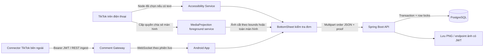
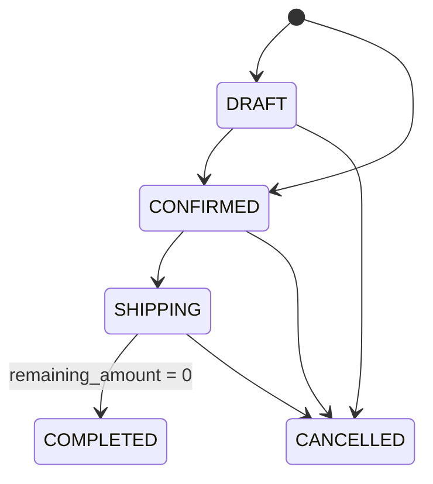

# Kiến trúc và quy tắc nghiệp vụ

## Các thành phần

Backend Spring MVC và JPA dùng transaction blocking; app dùng Retrofit suspend API/Coroutines.
JPA entities là class có no-arg/all-open plugins; request/response là data class.
Không trả entity trực tiếp, không serialize password hoặc proxy lazy ra API.

## Tiền

Mọi phép tính dùng `BigDecimal`, không dùng `Double`. Tiền là VND, tối đa hai chữ số thập phân.

| Trường | Ý nghĩa / công thức |
| --- | --- |
| `subtotal_amount` | Tổng `quantity × price_at_purchase` |
| `deposit_amount` | Tổng tiền đã nhận dưới dạng cọc |
| `shipping_fee` | Phí ship khách phải trả |
| `total_amount` | `subtotal_amount - deposit_amount + shipping_fee`, theo yêu cầu |
| `paid_amount` | Tổng tiền đã thu **ngoài cọc**, không phải khoản thu mới cộng thêm |
| `remaining_amount` | `total_amount - paid_amount`; số tiền còn phải thu |
| `total_cost` | Tổng `quantity × cost_at_purchase` |

Đơn mới có `paid_amount = 0`, nên `remaining_amount = total_amount`. Cọc và các khoản đã thu không được vượt tiền hàng + ship.
`payment_status` được tính từ số tiền, client không tự đặt `PAID`.
PUT payment dùng giá trị tổng để gọi lại cùng payload không thu tiền hai lần.
Đây là quản lý số tiền đã ghi nhận; API không trực tiếp trừ tiền ngân hàng.

`live_sessions.total_revenue` là tổng tiền hàng của đơn chưa hủy trong phiên, gồm cả đơn DRAFT đã giữ kho; không trừ cọc và không gồm phí ship.
Đây là giá trị đơn đã chốt/giữ kho, không phải doanh thu đã thu tiền. `total_orders` của khách/phiên cũng đếm đơn chưa hủy.

## Kho, đồng thời và gửi lại

Fast-create khóa lần lượt nhân viên → khách → các sản phẩm theo short_code tăng dần → phiên live.
Hủy khóa đơn → khách → sản phẩm cùng thứ tự → phiên live. Mã hàng không đổi sau khi tạo để thứ tự khóa ổn định.
Khi entity đã được đọc trước lúc lấy khóa, `refresh(..., PESSIMISTIC_WRITE)` lấy lại số liệu mới nhất.
Toàn bộ stock/counters/items/amounts commit hoặc rollback cùng nhau.

Kho được giữ ngay ở DRAFT/CONFIRMED. Hủy chỉ hoàn khi `stock_reserved = true`, rồi đặt false.
Gửi lại CANCELLED trả cùng trạng thái, không hoàn kho lần hai. Giá/vốn trong order_items là snapshot.

`requestId` là UUID do client tạo cho một lần xác nhận; unique theo `(user_id, request_id)`.
Khi gửi lại cùng UUID, backend trả đơn đã có và bỏ qua payload/file mới. UUID mới nghĩa là đơn mới.
App khóa dữ liệu khi kết quả gửi chưa rõ và cho gửi lại cùng đơn. Đóng form hoặc app bị hệ điều hành hủy sẽ mất draft đang giữ trong bộ nhớ;
nếu đã gửi và chưa biết kết quả, hãy tra danh sách đơn trước khi tạo lại từ đầu.
Tranh chấp tạo mới hồ sơ khách chưa tồn tại được UNIQUE constraint bảo vệ; một yêu cầu có thể nhận 409 và gửi lại cùng UUID.

## Trạng thái

COMPLETED/CANCELLED là trạng thái kết thúc. Không mở lại đơn đã hủy. Trả hàng sau hoàn tất và hoàn tiền cần nghiệp vụ riêng,
không được mô phỏng bằng cách đổi trạng thái qua lại. Hủy không tự thực hiện hoàn tiền qua ngân hàng.

## JWT, ảnh và quyền

Login trả JWT HS256 có issuer `cherri-diary`, subject là user ID và thời hạn 8 giờ.
Secret lấy từ môi trường, ít nhất 32 byte. Mật khẩu BCrypt, staff ID lấy từ JWT;
role và is_active được đọc lại từ DB cho mỗi request. Staff chốt và quản lý đơn; admin còn quản lý sản phẩm, nhân viên, blacklist.
WebSocket kiểm tra JWT khi upgrade và đóng phiên hết hạn/tài khoản bị khóa tối đa sau một phút.
Rate limit login hiện nằm trong bộ nhớ từng instance; triển khai nhiều instance cần limiter dùng chung.

Proof nhận PNG/JPEG tối đa 5 MB/20 megapixel, kiểm tra nội dung, encode lại PNG và đặt filename UUID.
Client filename không được dùng cho đường dẫn. Ảnh nằm ngoài static directory và GET ảnh cần Bearer JWT.
Rollback transaction xóa file đã tạo; crash giữa ghi file và commit có thể để lại orphan file, cần dọn định kỳ khi vận hành.
Nếu triển khai nhiều instance, thay local storage bằng object storage dùng chung và thiết kế cleanup/reconciliation.

## Android và TikTok

Nút nổi dùng `TYPE_APPLICATION_OVERLAY`, dịch vụ foreground loại `specialUse` và quyền do người dùng bật.
MediaProjection cần consent cho mỗi phiên mới. Một phiên tạo VirtualDisplay một lần, có thể lấy nhiều ảnh từ display đó;
không dùng lại consent Intent sau khi phiên dừng. Frame không được lưu/upload trừ lúc nhân viên bấm chụp.
Khi tắt nút nổi, service chụp dừng và giải phóng display/projection.

Accessibility chỉ nhận sự kiện click/selected/focused từ hai package TikTok đã khai báo; không quét toàn màn hình.
Text/bounds đã chọn được giữ trong bộ nhớ tối đa 30 giây. Nội dung/bounds có thể thay đổi khi live cuộn;
nhân viên phải kiểm tra ảnh và nội dung trước submit. Nếu không có text/bounds, nhập comment và kiểm tra ảnh toàn màn hình.
Không dùng PixelCopy để giả định có thể đọc surface của ứng dụng khác.

Token storage hiện dùng EncryptedSharedPreferences theo yêu cầu; thư viện đã deprecated nên khi nâng nền tảng có thể chuyển sang DataStore
kết hợp mã hóa Android Keystore. Không lưu token plaintext trong DataStore. Backup/shared-preferences transfer bị tắt.
Debug cho phép HTTP local; release chỉ HTTPS, không gắn Bearer vào request login và không theo redirect sang host khác.

Gateway là hợp đồng trung gian đã triển khai, không phải một TikTok SDK đã đăng nhập tài khoản thật.
Connector được chọn sau đó phải chuẩn hóa sự kiện theo API, dùng eventId duy nhất và thông tin phiên live.
Gateway giữ eventId chống trùng trong RAM 5 phút và không replay lịch sử; quy mô nhiều node hoặc cần replay phải dùng broker/persistent log.

Nguồn API nền tảng: [MediaProjection](https://developer.android.com/media/grow/media-projection),
[Accessibility service](https://developer.android.com/guide/topics/ui/accessibility/service),
[Spring Data JPA locking](https://docs.spring.io/spring-data/jpa/reference/jpa/locking.html).
